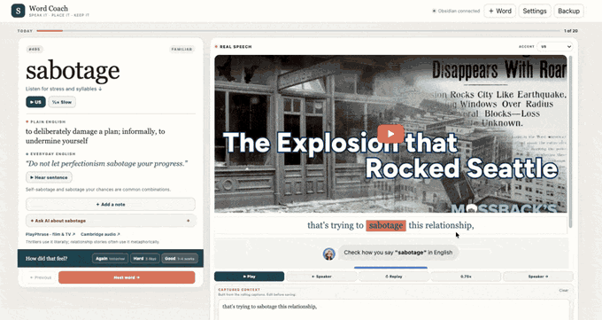

# Word Coach

**A personal English word coach for non-native professionals, built with AI.**

<!-- TODO: replace with docs/demo.gif (15–25s: word card → real-voice video → Ask AI → mark reviewed) -->


## Why I built it

I'm a bilingual data scientist. My English is strong at work, but I kept running
into words I half-knew: is it formal or casual, can I say it in a meeting, how does a
native speaker actually use it? Flashcard apps gave me definitions, not *register*
or *real usage*. So I built the tool I wanted: a daily 20-word session that shows how
a word sounds in real speech and lets me ask "would a native say this?" on the spot.

## How it works

```
Browser UI  ⇄  local Python server (stdlib only)  ⇄  Markdown notes + CSV (Obsidian vault)
                        │
                        └──►  LLM (OpenAI or any OpenAI-compatible API) for the "Ask AI" panel
```

- **Daily session**: due reviews first, then new words, then familiar ones (simple spaced repetition: ease + interval per word).
- **Real-world examples**: embeds the YouGlish widget so each word plays in real videos with captions; you can save a sentence + its source link into the word's note.
- **Ask AI**: a usage coach prompt tuned for register, connotation and "what would a native infer?", fed with the current word, your note and the caption being played.
- **Notes are just Markdown** in your vault, so Obsidian stays the source of truth. Every review is appended to a log (the raw material for retention analysis).
- **No dependencies**: Python 3 standard library + vanilla JS. Settings and API keys stay in local git-ignored files.

## How I used AI

Built with Claude Code as a pair programmer: I owned the product decisions (session
design, what "review" means, what stays private), wrote the usage-coach system prompt,
and reviewed every diff. Things I changed by hand or caught in review:

- Pointed the app's data paths at env vars so code and personal data live in separate places.
- Found that reasoning models on OpenAI-compatible gateways returned an empty answer because hidden reasoning ate the token budget, and raised the limit.
- Kept AI answers out of my notes unless I explicitly click "Add useful part to my note".

## Quickstart

```bash
git clone https://github.com/<your-username>/word-coach.git
cd word-coach
python3 server.py        # opens http://127.0.0.1:8765 with 20 sample words
```

That runs against `sample/` — nothing personal, no API key needed. Review progress
is written to `sample/notes/` (git-ignored).

**Use your own words / vault**: copy `.env.example` to `.env`, set `WORD_COACH_VAULT`
to your Obsidian vault (expects `Vocabulary/Youdao Vocabulary.csv` with columns
`source_number,word,extraction_status,source_image`), and start with `./start.command`.
Word meanings and examples come from `contexts.json`; point `WORD_COACH_CONTEXTS` at your own.

**Ask AI** (optional): open *Settings* in the app, choose OpenAI or an OpenAI-compatible
provider, and paste a key. It is saved to `.word-coach-settings.json` (owner-only, git-ignored).

**macOS launcher**: `launcher/Word Coach.app` is a double-click wrapper for `start.command`
(defaults to `~/Documents/GitHub/word-coach`; override with `WORD_COACH_APP_DIR`).

## What the data says

_Coming next: `ANALYSIS.md` — retention by word, forgetting curve, and words mastered per week, computed from the review log._

## What I learned / next

- The most valuable feature is not the flashcard, it's the question "would a native say this?" — register is where non-native speakers get caught.
- Local-first plus plain Markdown makes the data easy to analyze later.
- Next: the analytics layer above, and auto-ingesting new words from what I read.

## License

MIT
